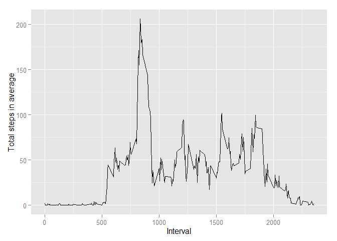
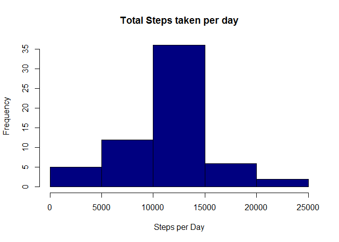
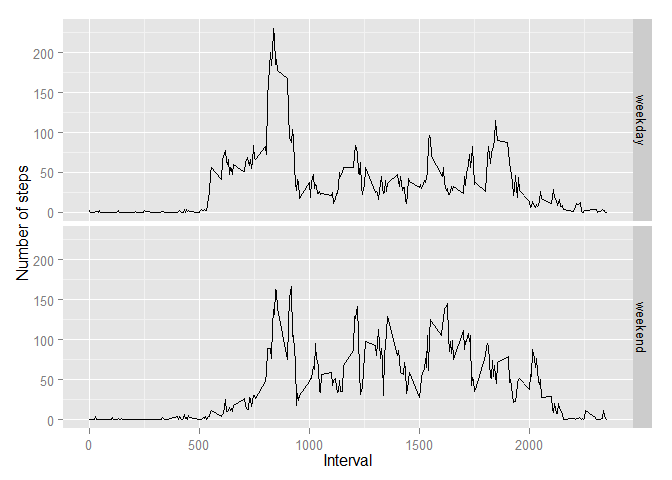

# Reproducible Research: Peer Assessment 1

## Loading and preprocessing the data

```r
  ## 1. Load the data (i.e. read.csv() )
  file_name <- "activity"
  message("Extract the input zip file")
```

```
## Extract the input zip file
```

```r
  unzip(paste(file_name, "zip", sep = "."))
  message("Read the csv file and store to a local variable")
```

```
## Read the csv file and store to a local variable
```

```r
  activities_csv <- read.csv(paste(file_name, "csv", sep = "."))
```


## What is mean total number of steps taken per day?

```r
  ## 2. Process/transform the data (if necessary) into a format suitable for your analysis
  message("Sum the steps by date and remove the NAN values")
```

```
## Sum the steps by date and remove the NAN values
```

```r
  sum_steps_by_date = tapply(X = activities_csv$steps,
               INDEX = activities_csv$date,
               FUN = sum,
               na.rm = TRUE)

  mean_steps <- mean(x = sum_steps_by_date, na.rm = TRUE)
  message(paste("The mean of the total number of steps taken per day [", mean_steps, "]", sep = ""))
```

```
## The mean of the total number of steps taken per day [9354.22950819672]
```

```r
  median_steps <- median(x = sum_steps_by_date, na.rm = TRUE)
  message(paste("The meadian of the total number of steps taken per day [", median_steps, "]", sep = ""))
```

```
## The meadian of the total number of steps taken per day [10395]
```


## What is the average daily activity pattern?
#### Plot to see the activity pattern

```r
  library(ggplot2)
```

```
## Warning: package 'ggplot2' was built under R version 3.1.3
```

```r
  ## Make a time series plot (i.e. type = "l") of the 5-minute interval (x-axis) 
  ## and the average number of steps taken, averaged across all days (y-axis)
  aggregate_steps <- aggregate(x=list(steps=activities_csv$steps),
            by=list(interval=activities_csv$interval),
            FUN=mean,
            na.rm=TRUE)

  ggplot(data = aggregate_steps, aes(x=interval, y=steps)) +
    geom_line() +
    xlab("Interval") +
    ylab("Total steps in average")
```

 
#### Find the maximum number of steps

```r
  ## Which 5-minute interval, on average across all the days in the dataset, contains the maximum number of steps?
  max_steps <- aggregate_steps[which.max(aggregate_steps$steps),]
  message(paste("The maximum number of steps [", mean_steps, "]", sep = ""))
```

```
## The maximum number of steps [9354.22950819672]
```


## Imputing missing values
#### Count the missing values in the dataset

```r
  ## Calculate and report the total number of missing values in the dataset (i.e.
  ## the total number of rows with NAs)

  missing_steps <- sum(is.na(activities_csv$steps))
  message(paste("The total row with missing steps are [", missing_steps, "]"))
```

```
## The total row with missing steps are [ 2304 ]
```

#### Normalize the data by replace the NA values

```r
  ## Normalize the activities by replacing NAs value with the mean
  
  normalizeMissingValues <- function(activities) {
    # Devise a strategy for filling in all of the missing values in the dataset.
    # The strategy doe not need to be sophisticated. For example, you could use
    # the mean/median for that day, or the mean for that 5-minute interval, etc.
    normalize_activities <- activities
    meansteps <- tapply(normalize_activities$steps,normalize_activities$interval, mean,na.rm=TRUE)
    na_data <-  which(is.na(normalize_activities))
    imputed_values <- meansteps[as.character(normalize_activities[na_data,3])]
    names(imputed_values) <- na_data
    for (i in na_data) {
      normalize_activities$steps[i] = imputed_values[as.character(i)]
    }

    return (normalize_activities)
  }
  normalize_activities <- normalizeMissingValues(activities_csv)
```
#### Calculate new mean and median

```r
  sum_steps_by_date = tapply(X = normalize_activities$steps,
               INDEX = normalize_activities$date,
               FUN = sum,
               na.rm = TRUE)

  mean_steps <- mean(x = sum_steps_by_date, na.rm = TRUE)
  message(paste("The new mean of the total number of steps taken per day [", mean_steps, "]", sep = ""))
```

```
## The new mean of the total number of steps taken per day [10766.1886792453]
```

```r
  median_steps <- median(x = sum_steps_by_date, na.rm = TRUE)
  message(paste("The new meadian of the total number of steps taken per day [", median_steps, "]", sep = ""))
```

```
## The new meadian of the total number of steps taken per day [10766.1886792453]
```
#### A: Mean and Median are equivalent after the normalizing

#### Make a histogram of the total number of steps taken each day

```r
  total_steps <- tapply(normalize_activities$steps, normalize_activities$date,sum)
  hist(total_steps,col="navy",xlab="Steps per Day",
     ylab="Frequency", main="Total Steps taken per day")
```

 

## Are there differences in activity patterns between weekdays and weekends?

#### Adding day column to non-NA activities

```r
  addDayColumn <- function(activities) {
    ## Create a new factor variable in the dataset with two levels - "weekday" and "weekend" 
    ## indicating whether a given date is a weekday or weekend day.
    whichDay <- function(date) {
    day <- weekdays(as.Date(date))
    if(day %in% c('Saturday', 'Sunday')){
      return('weekend')
    }
    return("weekday")
    }
    activities$day <- sapply(activities$date, FUN=whichDay)

    return (activities)
  }
  
  normalize_activities <- addDayColumn(normalize_activities)
```
#### Plot to compare between weekday and weekend

```r
  aggregate_steps <- aggregate(steps ~ interval + day, data=normalize_activities, mean)
  
  ggplot(aggregate_steps, aes(interval, steps)) + geom_line() + facet_grid(day ~ .) +
      xlab("Interval") + ylab("Number of steps")
```

 
